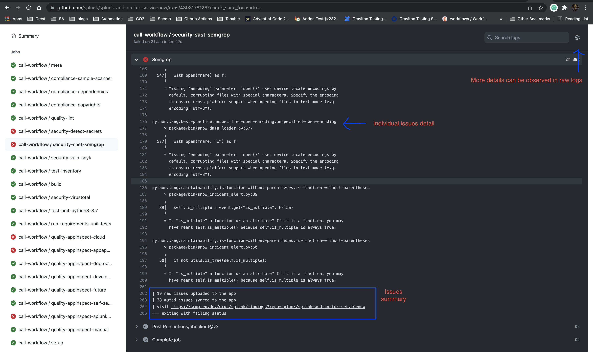
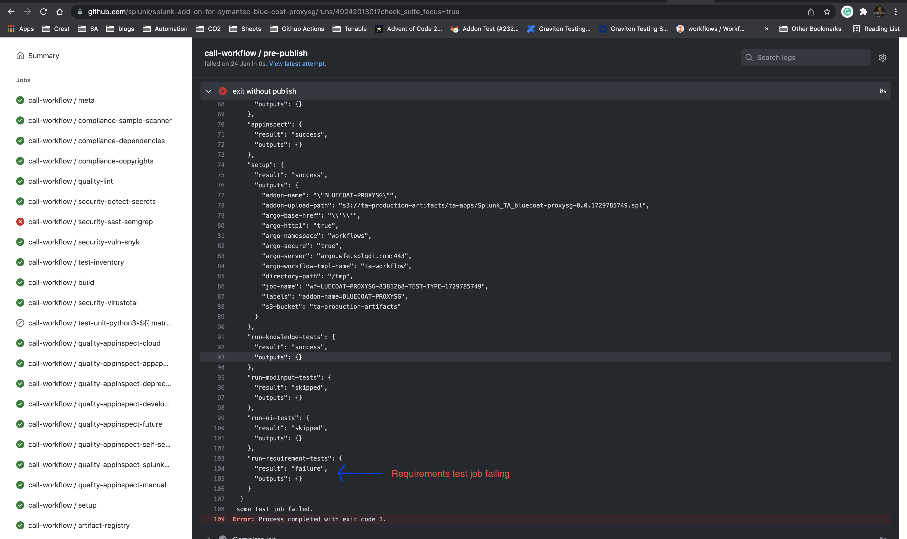

# Reusable workflow

This repository stores reusable `build-test-release` workflow, which is used to build, test and release Splunk add-ons.

Workflow is used by add-ons created and managed by [addonfactory repository template](https://github.com/splunk/addonfactory-repository-template).

Workflow defines jobs which perform security code scanning, execute different types of tests, build add-on package and make a GitHub release.

## Development flow

* All the changes should first go to the `develop` branch (using "squash commit"), `main` branch should contain stable code
* Official releases are made from `main` branch (when it's time to rollout new template changes):
  * create a PR from `develop` to `main`
  * test it
  * get all the approvals from the team
  * then merge it using "merge commit" option
* If bugfix release is needed:
  * make a change
  * test it
  * create a PR to the `main` branch
  * get all the approvals from the team
  * merge it using "squash commit" option
  * backport the change back to the `develop` branch
  * new version of the workflow is going to be released (v4.17.0 (before) -> v4.17.1 (after)) and it will automatically applied to all the repositories

# Troubleshooting for different workflow stages in GitHub Actions

## General troubleshooting

* For each stage there are logs which provides list of failures or link the test report for the stage or more details like error code regarding what caused the stage to fail.
* Check if there is any similar issue reported to GitHub repo for the action by other users.
* If you are not sure what to do, please use `go/addon/help`.

## setup-workflow

Job that is scanning PR and based on PR body or included labels defining tests to be executed.

* All tests are executed by default when (controlled from [here](https://github.com/splunk/addonfactory-repository-template/blob/main/enforce/.github/workflows/build-test-release.yml))
  * PR target branch is `main` (unless `use_labels` label is used then specific test labels (see below) should be added to execute specific test types) 
  * push event on branches `main`, `develop` and on `tags` (on release)
  * schedule event (controlled from [here](https://github.com/splunk/addonfactory-repository-template/blob/main/tools/jinja_parameters.yml))
* To trigger specific test type
  * add to PR one or multiple labels, available choices can be found [here](https://github.com/splunk/addonfactory-workflow-addon-release/blob/4f3fa4d779b6ec7649f0dc6b973eb4d68e5fcc48/.github/workflows/reusable-build-test-release.yml#L153)
  * there is no need to add labels when PR's target branch is `main`

meta stage
=======================

**Description:** 

- Determines which Splunk and SC4S versions to run tests with.

fossa-scan
=======================

**Description:**

- This action scans a project for third party components and creates report the with the results. This file job uses `.fossa.yml` configuration file

- Detected issues can be found in FOSSA app site https://app.fossa.com/. Link to direct report is generated per job and printed in logs

**Pass/fail behaviour:**

- This stage fails if FOSSA cannot create report - for example some internal FOSSA error

**Troubleshooting steps for failures if any:** 

- The error log is present in the stage as well user should be able to run FOSSA in local environment with FOSSA CLI tool https://github.com/fossas/fossa-cli


**Artifacts:**

```
THIRDPARTY
```

fossa-test
=======================

**Description:**

- This action checks report created in fossa-scan job. This action checks license compliance and vulnerabilities. This job uses `.fossa.yml` configuration file

**Pass/fail behaviour:**

- This stage fails if FOSSA finds any license or security issues. Detected issues can be found in FOSSA app site https://app.fossa.com/. Link to direct report is generated in fossa-scan job. License issues should be checked by legal team, vulnerabilities should be solved by TA-dev or TA-qa team with assist of prodsec team if needed (some issues with critical status for example).

**Troubleshooting steps for failures if any:** 

- The error log is present in the stage as well user should be able to reproduce that in local environment with FOSSA CLI tool https://github.com/fossas/fossa-cli

**Artifacts:**

- No additional Artifacts.


compliance-copyrights
=====================

**Description**

- This action runs the reuse lint command over your repository to check the following information:

  - Is copyright and licensing information available for every single file?

  - Do license texts exist for all found license identifiers?

  - Are there any other problems with detecting copyright and licensing information?

  - This action uses the REUSE helper tool. For more features, please install the tool locally.

**Action used** https://github.com/fsfe/reuse-action


**Pass/fail behaviour**

- If there exists a file missing copyright and licensing information this stage will fail.

- Adding copyright and licensing information to the files should fix the stage.

i.e 

**Exception file:** 

- For files which can't have copyrights inside we can add them in `.reuse/dep5` to ignore false positives.

- ref: https://github.com/splunk/splunk-add-on-for-microsoft-sysmon/blob/main/.reuse/dep5

**Artifacts:**

- No additional Artifacts.


lint 
=======================

**Description:** 

- Uses [pre-commit](https://pre-commit.com) to run linters (Python, Java, JS and others)

**Action used** https://github.com/pre-commit/action

**Pass/fail behaviour:**

- If the stage detects a linting error in the code the stage would fail with error information.

**Troubleshooting steps for failures if any**

- User can install `pre-commit` locally and run all the linters locally (`pre-commit run --all-files`) and resolve all the issues without the necessity to test changes in the CI.

- User can look through the details for failures in logs and browse how to resolve a specific linters error i.e for flake8 failures one in install flake8 in local env and fix the failures and push to the repository.

- If your add-on has some Java code, you need to have Java installed locally, so Java linter will work.

**Artifacts:**

- No additional artifacts, failure details are available in the logs.


security-detect-secrets
=======================

**Description:**

- This action is intended as a Continuous Integration secret scan in an already "clean" repository.

- The stage checks for addition/deletion of any secret/sensitive data in referenced commits (commits pushed or commits within PR).

**Action used** https://github.com/trufflesecurity/trufflehog

**Pass/fail behaviour**

- The stage is likely to fail if any sensitive secrets or confidential data were removed or added in the referenced commits.

**Troubleshooting steps for failures if any**

- User would need to update the commit history where the sensitive information is detected.

**Exception File**

- To ignore the file add the path of the file having the false positive in the `.github/workflows/exclude-patterns.txt`, ideally this should be avoided and only specific false positives should be added in exception files. This is file with newline separated regexes for files to exclude in scan.

- False positives include: public keys, random / dummy session keys or tokens.

- User can add a `trufflehog:ignore` comment on the line containing the secret to ignore that secrets.

**Artifacts:**

- No additional artifacts, the commit info and secrets details are available in the logs.


security-sast-semgrep
=======================

**Description:**

- Semgrep CI behaves like other static analysis and linting tools: it runs a set of user-configured rules and returns a non-zero exit code if there are findings, resulting in its job showing a ✅ or ❌.
- Semgrep can do two scan types: 
  - diff-aware scan, performed while workflow triggering event is pull request and scans only changes in files, which keeps the scan fast and reduces finding duplication.
  - full scan, performed while workflow triggering event is other event (e.g. push) and scans the whole codebase.

**Pass/fail behaviour**

- The stage is likely to fail If there are any findings violating the rule set/policies configured in Semgrep.

- Default semgrep policies: `prodsec-ccf-ruleset`: https://semgrep.dev/orgs/splunk/policies/prodsec-ccf-ruleset 

- User can search for project specific policies by selecting the project here https://semgrep.dev/orgs/splunk/projects and list policies here https://semgrep.dev/orgs/splunk/policies (login with Github account)

**Troubleshooting steps for failures:**

- For failures user should go through the logs once understand the failures, fix them if they are fixable and update the code accordingly.

- It might happen that Semgrep stage passed on the PR run but fails after merging to main this is because both are diff actions, as pull request only runs on changes made but push would run for entire code base, so unless main is free of all semgrep issues this failure difference would show up.

- For semgrep-action it always uses the latest release version of Semgep and there is no feasible way to downgrade the version used in our github pipeline

- Hence if the stage starts failing without any changes in code it might be due to some changes in the latest version of semgrep user can check for the updates done in the latest release.

- 

**Exception file:** 

- `.semgrepignore` i.e https://github.com/splunk/splunk-add-on-for-servicenow/blob/main/.semgrepignore

- User can add `# nosemgrep reason - 'Valid reason to ignore'` at the specific line to ignore the false positives, 
- i.e: https://github.com/splunk/addonfactory-cloudconnect-library/pull/92/files#diff-a24b951a8bc8acd3ed4e1378e1b12fcb87f037ef40cf80c1072e61995fe33671R96

**Artifacts:**

- Findings can be observed in the console logs of the stage and also at Semgrep link for which is provided in the end.

test-inventory
=======================

**Description**

- This stage detects the no of test-types present in the addons tests folder

**Output:**

```
requirement_test::true
ui_local::true
knowledge::true
unit::true
modinput_functional::true
```

build
=======================

**Description**

- This stage create the UCC build for the addon, generates the SPL file using slim uploads it to the Github registry.

**Action used**

- (UCC) https://github.com/splunk/addonfactory-ucc-generator

- (Slim) https://github.com/splunk/addonfactory-packaging-toolkit-action

**Pass/fail behaviour**

**Troubleshooting steps for failures if any**

- For UI based addons the build stage requires additional steps and uses UCC framework to build UI components if the stage fails or the generated build does not have expected behavio we can troubleshoot and fix the issues by generating build locally.

- Official documentation: https://splunk.github.io/addonfactory-ucc-generator/

**Artifacts:**

- package-deployment.zip includes

```
Splunk_TA_mysql-0.237.1242169071-_search_heads.spl
Splunk_TA_mysql-0.237.1242169071-_indexers.spl
Splunk_TA_mysql-0.237.1242169071-_forwarders.spl
installation-actions.json
installation-update.json
```
- package-splunkbase includes Splunkbase equivalent package code


AppInspect
=======================

**Description**

- Splunk AppInspect performs validation checks on your Splunk app package against a set of standardized criteria to evaluate the app structure, features, security, and adherence to Splunk Cloud Platform requirements.

- https://dev.splunk.com/enterprise/docs/developapps/testvalidate/appinspect/

- Respective Appinspect tags used in stage:

- https://dev.splunk.com/enterprise/docs/developapps/testvalidate/appinspect/#Validate-an-app-using-tags

```
cloud
appapproval
deprecated_feature
developer_guidance
future
self-service
splunk_appinspect
manual
```
**Action used:** https://github.com/splunk/appinspect-cli-action

**Pass/fail behaviour:**

- Splunk AppInspect generates a report that details the successes, warnings, and failures flagged by the checks.

- By using the results of the report, user can fix any issues in your app before you submit it for cloud vetting or for publication to Splunkbase.

**Exception file:** 

- `.app-vetting.yaml` We can use this file to add false positives with appropriate comments.

- ref: https://github.com/splunk/splunk-add-on-for-microsoft-windows/blob/main/.app-vetting.yaml - Connect to preview  

**Troubleshooting steps for failures if any:**

- User can refer to this for failures https://dev.splunk.com/enterprise/docs/developapps/testvalidate/appinspect/#Common-issues-reported-by-Splunk-AppInspect

- User can run the appinspect locally as well to troubleshoot, validate and fix failures https://dev.splunk.com/enterprise/docs/developapps/testvalidate/appinspect/useappinspectclitool

**Artifacts:**

```
appinspect_appapproval_checks.json
appinspect_cloud_checks.json
appinspect_deprecated_feature_checks.json
appinspect_developer_guidance_checks.json
appinspect_future_checks.json
appinspect_manual_checks.json
appinspect_self-service_checks.json
appinspect_splunk_appinspect_checks.json
```


AppInspect API
=======================

**Description**

- Splunk AppInspect performs validation checks on your Splunk app package against a set of standardized criteria to evaluate the app structure, features, security, and adherence to Splunk Cloud Platform requirements. Unlike previous job that uses AppInspect CLI, this one uses AppInspect API

- [https://dev.splunk.com/enterprise/docs/developapps/testvalidate/appinspect/](https://dev.splunk.com/enterprise/docs/developapps/testvalidate/appinspect/useappinspectapi/)

- Respective Appinspect tags used in stage:

- https://dev.splunk.com/enterprise/docs/developapps/testvalidate/appinspect/#Validate-an-app-using-tags

```
"cloud"
"self-service"
"" (no tags)
```
**Action used:** https://github.com/splunk/appinspect-api-action

**Pass/fail behaviour:**

- Splunk AppInspect API generates HTML report that details the successes, warnings, and failures flagged by the checks.

- By using the results of the report, user can fix any issues in your app before you submit it for cloud vetting or for publication to Splunkbase.

**Exception file:** 

- `.appinspect_api.expect.yaml` We can use this file to add false positives with appropriate comments.

- ref: https://github.com/splunk/splunk-add-on-for-cisco-meraki/blob/main/.app-vetting.yaml - Connect to preview  

**Troubleshooting steps for failures if any:**

- User can refer to this for failures https://dev.splunk.com/enterprise/docs/developapps/testvalidate/appinspect/#Common-issues-reported-by-Splunk-AppInspect


**Artifacts:**

```
appinspect-api-html-report
appinspect-api-html-report-cloud
appinspect-api-html-report-self-service
```


# setup

**Description:** 

- This stage does sets the required env variables before the test execution stage

**Action used:** NA

# test-unit-python3

**Description:**

- This stage does the setup for executing unit tests and reports the results

**Action used:** NA

**Pass/fail behaviour:**

- The stage is expected to fail only if there are unit test failures observed.

**Troubleshooting steps for failures if any**

- User can validate the test results by execution in local env.

**Artifacts:**

- Junit Test result xml file

# run-requirements-unit-tests
**Description**

- This action provides unit tests for Splunk TA's requirement logs. test_lib contains tests for XML format checking, schema validating and CIM model mapping.

**Action used** https://github.com/splunk/addonfactory-workflow-requirement-files-unit-tests

**Pass/fail behaviour:**

- The stage is expected to fail only if there are any test-case failures observed related to logs, CIM fields related issue or XML file does not matches the schema defined https://github.com/splunk/requirement-files-unit-tests/blob/main/test_lib/schema.xsd .

**Troubleshooting steps for failures if any**

- Check for failure logs and update the log/XML files accordingly to match the schema defined in the repo.

**Artifacts:**

```
test_validation_output.txt
test_transport_params_output.txt
test_format_output.txt
test_cim_output.txt
test_check_unicode_output.txt
```

# run-knowledge-tests

**Description:** 

- This stage does the setup for executing KO tests and reports the results

**Action used:** 
- No action used

**Pass/fail behaviour:** 

- The stage is expected to fail only if there are pytest_splunk_addon test failures observed.

**Troubleshooting steps for failures if any:**

- User can validate the test results by execution in local env.

- User can refer to the Assertion error logs in test-resutl.xml as for KO tests the error logs are very datailed.

- Based on the Assertion error logs of the test case like No data availabe in sourcetype , field_count does not match the event_count User can identify the issues and make necessary changes.

- Official troubleshooting doc https://pytest-splunk-addon.readthedocs.io/en/main/troubleshoot.html

**Exception file:** 

- `.pytest.expect` User can add failures here which can be ignored while test execution and will be marked as XFail

**NOTE:** There should be valid reasons and approvals from addon and automation PMs to add failures in this file.

**Artifacts:**

```
Junit XML file
pytest_splunk_addon.log
cim-field-report
cim-compliance-report
```

# run-ui-tests 

**Description**

- This stage does the setup for executing UI tests and reports the results
- It is possible to parallelize UI tests execution by using pytest markers. 
  To do so, one must specify `ui_marker` parameter in buid-test-release.yml as in [example](https://github.com/splunk/splunk-add-on-for-amazon-web-services/blob/925fd189737507dd91cc5275c59a8b390550411c/.github/workflows/build-test-release.yml#L35).
  Markers must be created prior and each test case must be marked (check [run-modinput-tests](#run-modinput-tests), and this [PR](https://github.com/splunk/splunk-add-on-for-amazon-web-services/pull/1237))

**Action used:** 
- No action used

**Pass/fail behaviour**

- The stage is expected to fail only if there are any UI test failures defined under tests/ui

**Troubleshooting steps for failures:**

- Make sure all the credentials under test_credentials.env in addons root folder are set in Github actions.

- we can validate the test-execution in local env and Observe the UI test behaviour.

- The Saucelabs link, test-result.xml can be used for identifying issues and more troubleshooting. 

- For failures similar to element not intercept-able, user needs to understand the test scenario and flow of testcase which elements are interacted and what actions are performed on the elements during the test case.

- Make sure each test case is independent in nature and does the required setup and teardown methods so it does not affect other tests in the test suite.

**Exception file:**

- `.pytest.expect` User can add failures here which can be ignored while test execution and will be marked as XFAIL

**NOTE:** There should be valid reasons and approvals from addon and automation PMs to add failures in this file.

**Artifacts:**

```
report.html
Screenshots for failed tests under assets folder
Junit XML file
```

# run-modinput-tests 

**Description**

- This stage does the setup for executing Modinput tests and reports the results
- It is possible to parallelize Modinput tests execution by using pytest markers. 
  To do so, one must specify `marker` parameter in buid-test-release.yml as in [example](https://github.com/splunk/splunk-add-on-for-amazon-web-services/blob/603f37ee24565f23104c0297e55a0c72480f34c9/.github/workflows/build-test-release.yml#L33).
  Markers must be created prior and each test case must be marked (check the following references: [ref1](https://github.com/splunk/splunk-add-on-for-amazon-web-services/blob/main/tests/modinput_functional/README-test.md), 
[ref2](https://github.com/splunk/splunk-add-on-for-amazon-web-services/blob/main/tests/modinput_functional/centaurs/tacommon/test_ta_mark.py), [ref3](https://github.com/splunk/splunk-add-on-for-amazon-web-services/blob/603f37ee24565f23104c0297e55a0c72480f34c9/tests/modinput_functional/data_collection/aws_s3/test_aws_s3_line_content.py#L20))

**Action used:** 
- No action

**Pass/fail behaviour**

- The stage is expected to fail only if there are any Modular input test failures defined under tests/modular_input

**Troubleshooting steps for failures if any:** 

- Make sure all the credentials under test_credentials.env in addons root folder are set in Github actions.

- we can validate the test-execution in local env and compare results.

- The `helmut.log` file, `test-result.xml` can be used for identifying errors.

- `helmut.log` file has detailed logs for each action for the test case we can observe the logs and troubleshoot what’s the root cause of failure

- Make sure setup and teardown methods works as expected in the test-case.

**Exception file:** 

- `.pytest.expect` User can add failures here which can be ignored while test execution and will be marked as XFail

**NOTE:** There should be valid reasons and approvals from addon and automation PMs to add failures in this file.

**Artifacts:**
```
helmut.log
Junit XML file
```

pre-publish
===========

**Description:**

- Publish stage works only for develop/main branch hence to verify if when PR is merged it would execute the Publish stage or not this pre-publish stage was added.

- Publish stage would trigger a new release in the repository based on conventional commits. 

- Ideally pre-publish stage should pass in each PR.

- This stage checks the test-results of all the previous jobs executed in the build and fails if there is a failing job which publish stage depends on.

**Action used:** 
- No action used

**Pass/fail behaviour:**

- If this stage is failing and PR is merged to main/develop Publsih stage will not get executed in the pipeline run.

**Troubleshooting steps for failures if any**

- In the logs it outputs a json with the info of stages and their pass/fail status. <br />
 

**Artifacts:**
- No additional artifacts


publish
=======
**Description**
- This stage only executes for main and develop branch.

- If the event is not a PR and pre-publish stage result is success Publish stage will get executed.

- It downloads the artifacts which are shown under assets in Releases Page

**Action used:** https://github.com/splunk/semantic-release-action

**Pass/fail behaviour:** 

- It releases a new release tag in the repository and uploads the assets to the release.

**Troubleshooting steps for failures if any**

- This stage depends majorly on Semantic release action so if Publish is failing check for logs or issues raised recently in Semantic release action.

- Validate in the logs there are no errors observed in other steps as well

**Artifacts:**

```
Splunk_TA_snow-7.2.0-_forwarders.spl
Splunk_TA_snow-7.2.0-_search_heads.spl
Splunk_TA_snow-7.2.0.spl
cim_field_report.json
installation-actions.json
installation-update.json
source_code.zip
source_code.tar.gz
```

Vendor Addon Matrix tests
=========================

- For addons like Tomcat, JMX, Nginx where multiple versions are supported for the Vendor platform currently only a single version of Vendor platform was configured while testing which is now parameterised to support test execution against different version of vendor platforms in Github Actions.

- To execute the tests against different versions of Vendor platforms.

- Create a `.vendormatrix` file ref: https://github.com/splunk/splunk-add-on-for-tomcat/pull/311/files#diff-fc231b3bce30bf25a7b22dcb0b120d9bdfa1f04a6e4397b1e0e5057142535d1eR1 

- Provide appropriate values for `VERSION` and `DOCKER_IMAGE` in the file.

- `DOCKER_IMAGE` can be official docker images or some other trusted regitries like bitnami-docker

- Another param is `TRIGGER_UI` if set to `False` UI tests for the given version of stanza would not be considered in matrix.

- i.e UI tests will be executed only for version `10.0` for below configs

- Modinput tests would be executed against all version, 2 splunk version and 3 
vendor version leads to 6 modinput test jobs ref: https://github.com/splunk/splunk-add-on-for-tomcat/actions/runs/1880616588

```
[8.5]
VERSION=8.5.73
DOCKER_IMAGE=8.5.73-debian-10-r58
TRIGGER_UI=False

[9.0]
VERSION=9.0.56
DOCKER_IMAGE=9.0.56-debian-10-r39
TRIGGER_UI=False

[10.0]
VERSION=10.0.14
DOCKER_IMAGE=10.0.14-debian-10-r39
```

- If and when Tomcat releases 11.x or 10.1.x or similar, all the developer/add-on team would have to do is just create a new stanza for the version and respective `DOCKER_IMAGE` to validate the behavior.
