# addonfactory-workflow-addon-release
Repository to store reusable `build-test-release` workflow, which is used to release Splunk add-ons. 
Worklow is used by add-ons created and managed by [addonfactory repository template](https://github.com/splunk/addonfactory-repository-template)
Workflow defines jobs which perform security code scanning, execute different types of tests, build add-on package, make github release.

## Example usage
```yaml
name: build-test-release
on:
  push:
    branches:
      - "main"
    tags:
      - "v[0-9]+.[0-9]+.[0-9]+"
  pull_request:
    branches: 
      - "**"

jobs:
  call-workflow:
    uses: splunk/addonfactory-workflow-addon-release/.github/workflows/reusable-build-test-release.yml@v1.2.0
    secrets:
      GH_TOKEN_ADMIN: ${{ secrets.GH_TOKEN_ADMIN }}
      GH_TOKEN: ${{ secrets.GITHUB_TOKEN }}
      SEMGREP_PUBLISH_TOKEN: ${{ secrets.SEMGREP_PUBLISH_TOKEN }}
      AWS_ACCESS_KEY_ID: ${{ secrets.AWS_ACCESS_KEY_ID }}
      AWS_DEFAULT_REGION: ${{ secrets.AWS_DEFAULT_REGION }}
      AWS_SECRET_ACCESS_KEY: ${{ secrets.AWS_SECRET_ACCESS_KEY }}
      VT_API_KEY: ${{ secrets.VT_API_KEY }}
      CODECOV_TOKEN: ${{ secrets.CODECOV_TOKEN }}
      OTHER_TA_REQUIRED_CONFIGS: ${{ secrets.OTHER_TA_REQUIRED_CONFIGS }}
```

***

# Troubleshooting for different workflow stages in Github Actions

General troubleshooting 
=======================

- For each stage there are logs which provides list of failures or link the test report for the stage or more details like error code regarding what caused the stage to fail.

- If execution of stage takes longer than expected and we can re-trigger a workflow with an empty commit to check is the issue with the stage is consistent.

- If the stage starts failing without any code change we can check the version of action used in the Github actions pipeline and check the behaviour with previous releases.

- Check if there is any similar issue reported to Github repo for the action by other users.

- Validate If the failure is caused by a code change in the action which modified behaviour in the latest release causing the stage to fail.


meta stage
==========

**Description:** 

- GitHub Action to extract metadata from Git reference and GitHub events.

**Action used:** https://github.com/docker/metadata-action 

**Artifacts:**

-  No Artifacts for this stage.

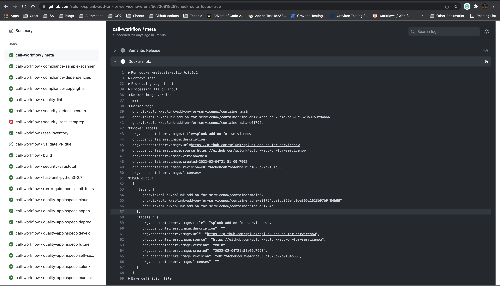


compliance-sample-scanner
=========================

**Description:** 

- This action scans Splunk Add-on test data for potentially identifying information which should be anonymized.

**Action used:** https://github.com/splunk/addonfactory-sample-scanner


**Pass/fail behaviour:** 

- The action will check `tests/knowledge/*` for potentially identifying data and update the build or pr with annotations identifying violations.

**Troubleshooting steps for failures if any:**

- Tokenise the sensitive data which is shown in the failures using PSA tool's data generator  Data Generator — pytest-splunk-addon  documentation 

- If you get failures in the .samples or .sample file, replace that value with a token, and add that token's replacement, relevant details

**Exception file:**

- `.ge_ignore` in addon root folder All the false positive can be added in this file.

- ref: https://github.com/splunk/splunk-add-on-for-box/blob/4fe6f4ec2ceaf847211a335f6ca3c154cc805fb7/.ge_ignore  

**artifacts:**

- Annotations, and test report like is also available in stage logs

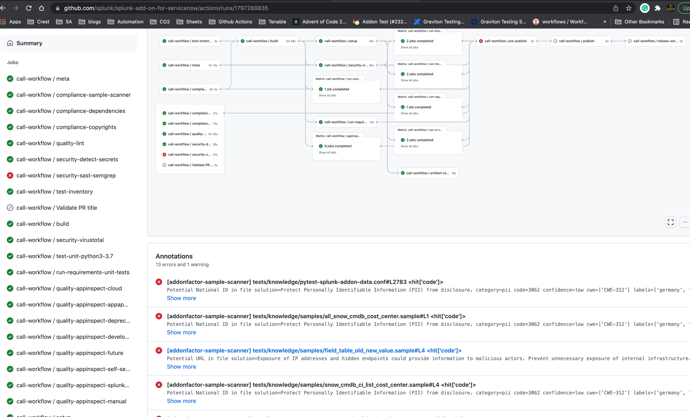
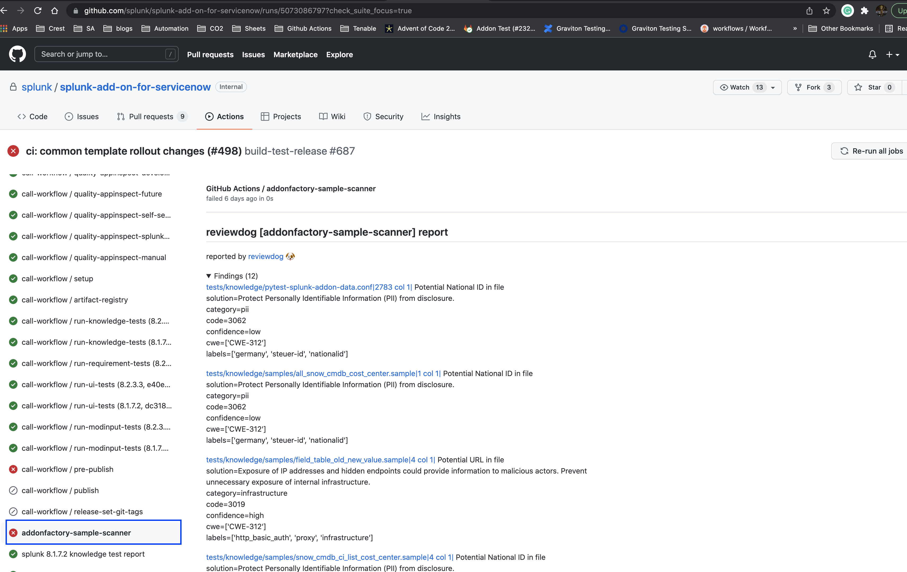
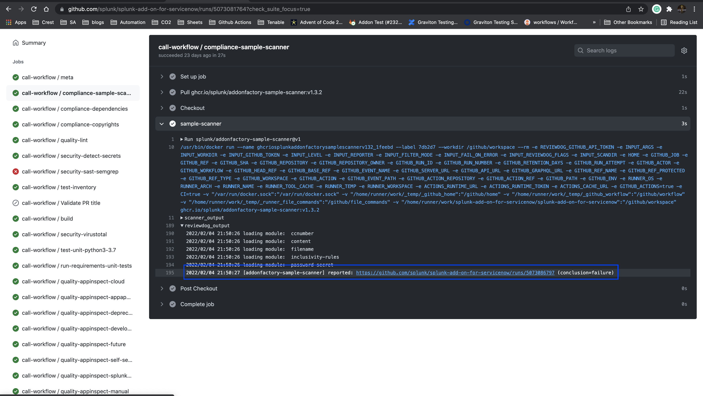


compliance-dependencies
=======================

**Description:**

- This action scans a project for third party components and reports the results. This action contains a curation file managed by Splunk Inc.

**Action used:** https://github.com/oss-review-toolkit/ort 

**Pass/fail behaviour:**

- This stage fails if there are any errors or dependencies while installing requirements.txt generated from pyproject.toml

**Troubleshooting steps for failures if any:** 

- The error log is present in the stage as well as in the artifacts scan-report.xlsx , user should be able to reproduce that in local and fix/update the requirements accordingly.

i.e 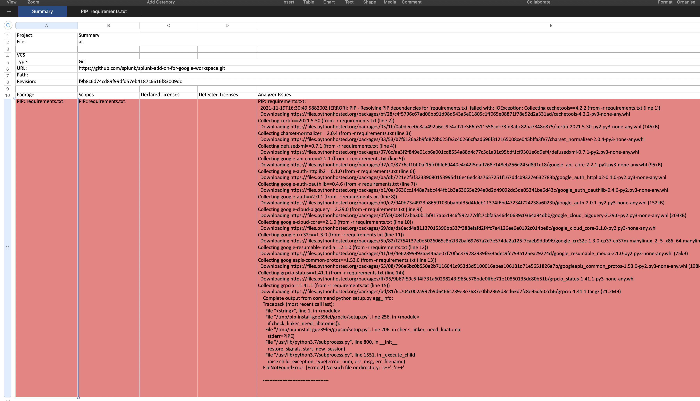


**artifacts:**

```
analysis-analyzer
    - analyzer-result.json

analysis-reports
    - scan-report.xlsx
    - NOTICE_summary
    - NOTICE_default
    - bom.spdx.yml
    - AsciiDoc_disclosure_document.pdf
```

compliance-copyrights
=====================

**Description**

- This action runs the reuse lint command over your repository to check the following information:

  - Is copyright and licensing information available for every single file?

  - Do license texts exist for all found license identifiers?

  - Are there any other problems with detecting copyright and licensing information?

  - This action uses the REUSE helper tool. For more features, please install the tool locally.

**Action used** https://github.com/fsfe/reuse-action


**Pass/fail behaviour**

- If there exists a file missing copyright and licensing information this stage will fail.

- Adding copyright and licensing information to the files should fix the stage.

i.e 

**artifacts:**

- No additional artifacts.


quality-lint 
============

**Description:** 

- It is a simple combination of various linters, written in bash, to help validate your source code.

**Action used** https://github.com/github/super-linter

**Pass/fail behaviour:**

- If the stage detects a linting error in the code the stage would fail with error information.

**Exception file**

- Since this action uses multiple linters there might be errors from multiple linters as well

- If there is a flake8 failure we can use .flake8 file and similarly for other linters as well, However its not necessary each linter will have its own ignore file.

**Troubleshooting steps for failures if any**

- User can look through the details for failures in logs and browse how to resolve a specific linters error i.e for flake8 failures one in install flake8 in local env and fix the failures and push to the repository.

i.e Summary: 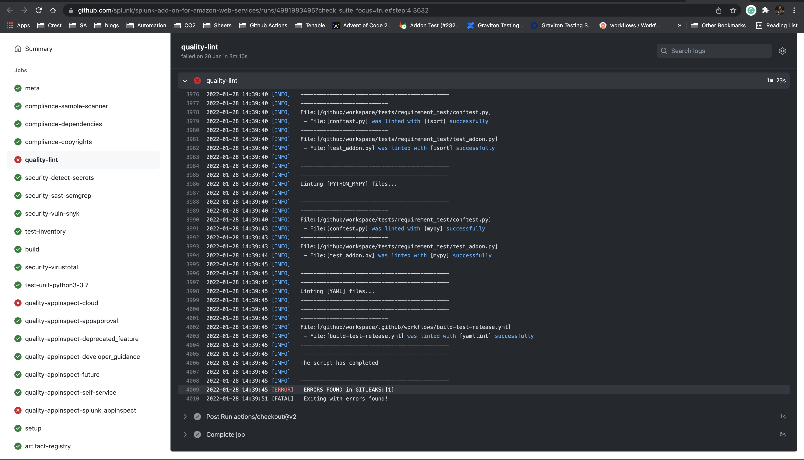
Specific Error in logs: 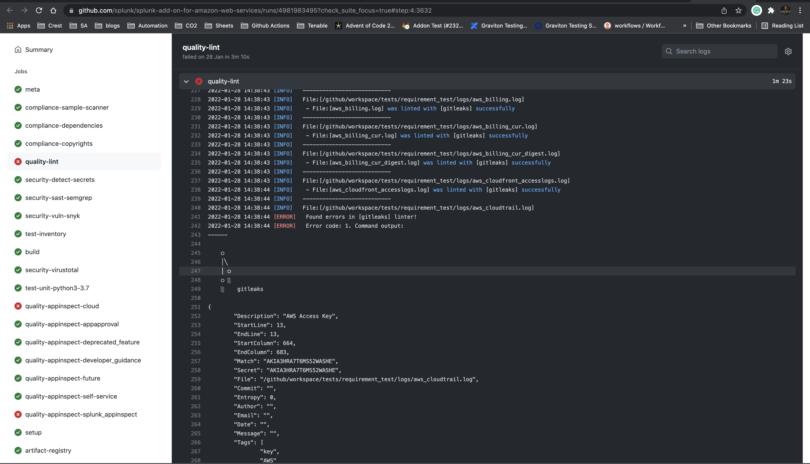 <br /> 
Summary: 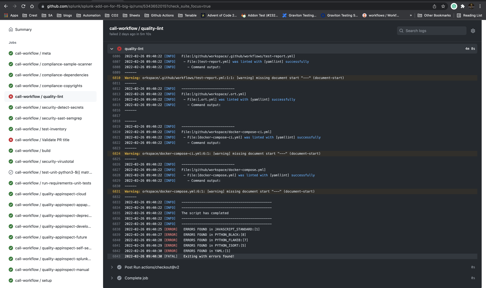


- If the logs are too long to display User can also access raw logs and search for issues. <br />
i.e 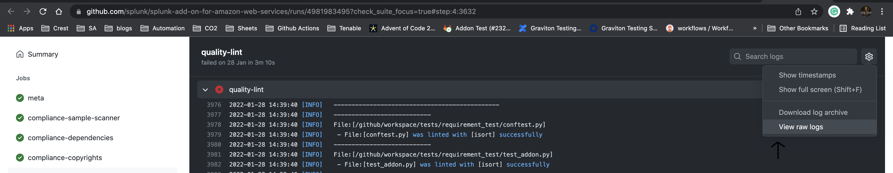

**artifacts:**

- No additional artifacts, Failure details are available in the logs.


security-detect-secrets
=======================

**Description:**

- This action is intended as a Continuous Integration secret scan in an already "clean" repository. The default commit scan depth is the last 50 commits and can be adjusted using Custom Arguments 

- The stage checks for addition/deletion of any secret/sensitive data in last 50 commits of the repository.

**Action used** https://github.com/edplato/trufflehog-actions-scan

**Pass/fail behaviour**

- The stage is likely to fail if there is some sensitive or secrets or confidential data had been removed or added in the last 50 commits.

**Troubleshooting steps for failures if any**

- User would need to update the commit history where the sensitive information is detected.

**Exception File**

- To ignore the file add the path of the file having the false positive in the `.github/workflows/exclude-patterns.txt`, ideally this should be avoided and only specific false positives should be added in exception files.

- False positives include: public keys, random / dummy session keys or tokens.

- We can use this file `.github/workflows/trufflehog-false-positive.json` from action version `>=v0.9l-beta` to add specific failures or regexes. 

- ref for how to add regex to json file : https://github.com/edplato/trufflehog-actions-scan#usage

- **NOTE:** The usage of `.github/workflows/trufflehog-false-positive.json` is not rolled out yet, PR for feature support: https://github.com/splunk/addonfactory-workflow-addon-release/pull/32


**artifacts:**

- No additional artifacts, the commit info is available in the logs.


security-sast-semgrep
=====================

**Description:**

- Semgrep CI behaves like other static analysis and linting tools: it runs a set of user-configured rules and returns a non-zero exit code if there are findings, resulting in its job showing a ✅ or ❌.

**Action used:** https://github.com/returntocorp/semgrep-action


**Pass/fail behaviour**

- The stage is likely to fail If there are any findings violating the rule set/policies configured in Semgrep.

- Default semgrep policies: `prodsec-ccf-ruleset`: https://semgrep.dev/orgs/splunk/policies/prodsec-ccf-ruleset 

- User can search for project specific policies by selecting the project here https://semgrep.dev/orgs/splunk/projects and list policies here https://semgrep.dev/orgs/splunk/policies (login with Github account)

**Troubleshooting steps for failures:**

- For failures user should go through the logs once understand the failures, fix them if they are fixable and update the code accordingly.

- It might happen that Semgrep stage passed on the PR run but fails after merging to main this is because both are diff actions, as pull request only runs on changes made but push would run for entire code base, so unless main is free of all semgrep issues this failure difference would show up.

- For semgrep-action it always uses the latest release version of Semgep and there is no feasible way to downgrade the version used in our github pipeline

- Hence if the stage starts failing without any changes in code it might be due to some changes in the latest version of semgrep user can check for the updates done in the latest release.

- 

**Exception file:** 

- `.semgrepignore` i.e https://github.com/splunk/splunk-add-on-for-servicenow/blob/main/.semgrepignore

- User can add `# nosemgrep reason - 'Valid reason to ignore'` at the specific line to ignore the false positives, 
- i.e: https://github.com/splunk/addonfactory-cloudconnect-library/pull/92/files#diff-a24b951a8bc8acd3ed4e1378e1b12fcb87f037ef40cf80c1072e61995fe33671R96

**artifacts:**

- Findings can be observed in the console logs of the stage and also at Semgrep link for which is provided in the end.

test-inventory
==============

**Description**

- This stage detects the no of test-types present in the addons tests folder

**Output:**

```
requirement_test::true
ui_local::true
knowledge::true
unit::true
modinput_functional::true
```

Validate PR title
=================

**Description**

- A Github Action that ensures that your PR title matches the Conventional Commits spec.

**Action used:** https://github.com/amannn/action-semantic-pull-request 

**Pass/fail behaviour:** 

- The PR title should follow the conventional commit standards 

- Examples for valid PR titles:

```
fix: Correct typo.

feat: Add support for Node 12.

refactor!: Drop support for Node 6.

feat(ui): Add Button component.
```

**Note** since PR titles only have a single line, you have to use the ! syntax for breaking changes.

See https://www.conventionalcommits.org/ for more examples.

build
=====

**Description**

- This stage create the UCC build for the addon, generates the SPL file using slim uploads it to the Github registry.

**Action used**

- (UCC) https://github.com/splunk/addonfactory-ucc-generator

- (Slim) https://github.com/splunk/addonfactory-packaging-toolkit-action

**Pass/fail behaviour**

**Troubleshooting steps for failures if any**

- For UI based addons the build stage requires additional steps and uses UCC framework to build UI components if the stage fails or the generated build does not have expected behavio we can troubleshoot and fix the issues by generating build locally.

- Official documentation: https://splunk.github.io/addonfactory-ucc-generator/

**artifacts:**

- package-deployment.zip includes

```
Splunk_TA_mysql-0.237.1242169071-_search_heads.spl
Splunk_TA_mysql-0.237.1242169071-_indexers.spl
Splunk_TA_mysql-0.237.1242169071-_forwarders.spl
installation-actions.json
installation-update.json
```
- package-splunkbase includes Splunkbase equivalent package code
- package-raw 

security-virustotal
===================

**Description**

GitHub Action to upload and scan files with VirusTotal which analyze files, domains, IPs and URLs to detect malware, suspicions and other breaches

**Action used** https://github.com/crazy-max/ghaction-virustotal

**Artifacts:**

- No Artifacts for this stage. Report link is available in the logs
- 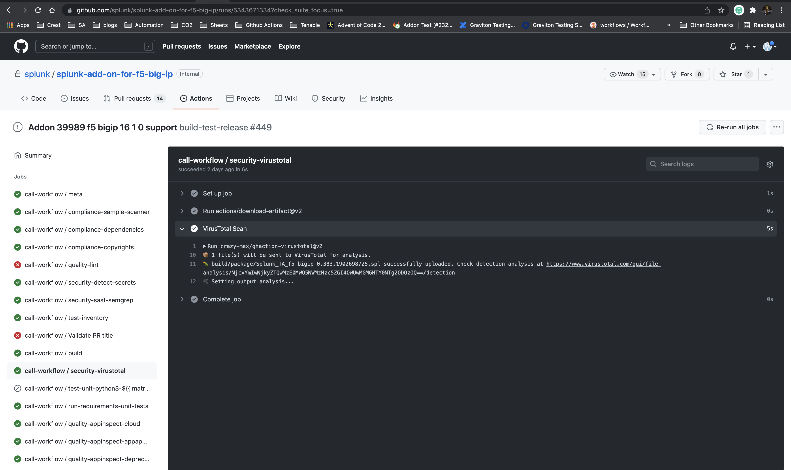 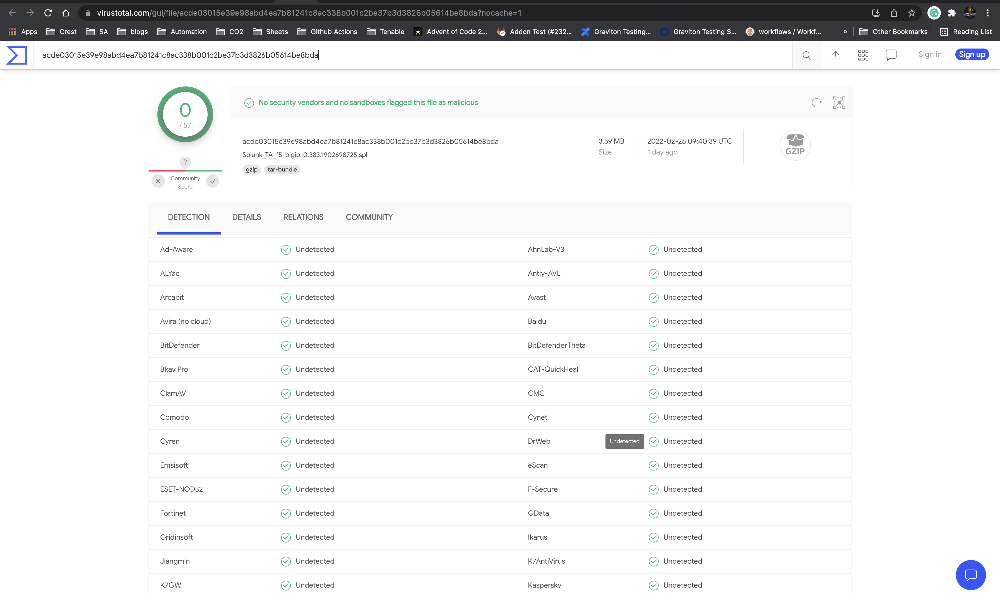 


AppInspect
==========

**Description**

- Splunk AppInspect performs validation checks on your Splunk app package against a set of standardized criteria to evaluate the app structure, features, security, and adherence to Splunk Cloud Platform requirements.

- https://dev.splunk.com/enterprise/docs/developapps/testvalidate/appinspect/

- Respective Appinspect tags used in stage:

- https://dev.splunk.com/enterprise/docs/developapps/testvalidate/appinspect/#Validate-an-app-using-tags

```
cloud
appapproval
deprecated_feature
developer_guidance
future
self-service
splunk_appinspect
manual
```
**Action used:** https://github.com/splunk/appinspect-cli-action

**Pass/fail behaviour:**

- Splunk AppInspect generates a report that details the successes, warnings, and failures flagged by the checks.

- By using the results of the report, user can fix any issues in your app before you submit it for cloud vetting or for publication to Splunkbase.

**Exception file:** 

- `.app-vetting.yaml` We can use this file to add false positives with appropriate comments.

- ref: https://github.com/splunk/splunk-add-on-for-microsoft-windows/blob/main/.app-vetting.yaml - Connect to preview  

**Troubleshooting steps for failures if any:**

- User can refer to this for failures https://dev.splunk.com/enterprise/docs/developapps/testvalidate/appinspect/#Common-issues-reported-by-Splunk-AppInspect

- User can run the appinspect locally as well to troubleshoot, validate and fix failures https://dev.splunk.com/enterprise/docs/developapps/testvalidate/appinspect/useappinspectclitool

**artifacts:**

```
appinspect_appapproval_checks.json
appinspect_cloud_checks.json
appinspect_deprecated_feature_checks.json
appinspect_developer_guidance_checks.json
appinspect_future_checks.json
appinspect_manual_checks.json
appinspect_self-service_checks.json
appinspect_splunk_appinspect_checks.json
```

# setup

**Description:** 

- This stage does sets the required env variables before the test execution stage

**Action used:** NA

# artifact-registry

**Description:**

- Uploads the generated addon build to ghcr.io.

**Action used:** 

- https://github.com/actions/download-artifact
- https://github.com/docker/setup-buildx-action
- https://github.com/docker/login-action 

**Artifacts:** 

- No artifacts

- This build can be downloaded using oras if it’s not availale in ghcr yet

- User can use the following command to download build for the respective PR

```
oras pull -u <github-username> -p <github-token> ghcr.io/splunk/splunk-add-on-for-microsoft-sql-server:Splunk_TA_microsoft-sqlserver-<PR-no> 
```

# test-unit-python3

**Description:**

- This stage does the setup for executing unit tests and reports the results

**Action used:** NA

**Pass/fail behaviour:**

- The stage is expected to fail only if there are unit test failures observed.

**Troubleshooting steps for failures if any**

- User can validate the test results by execution in local env.

**artifacts:**

- Junit Test result xml file

# run-requirements-unit-tests
**Description**

- This action provides unit tests for Splunk TA's requirement logs. test_lib contains tests for XML format checking, schema validating and CIM model mapping.

**Action used** https://github.com/splunk/addonfactory-workflow-requirement-files-unit-tests

**Pass/fail behaviour:**

- The stage is expected to fail only if there are any test-case failures observed related to logs, CIM fields related issue or XML file does not matches the schema defined https://github.com/splunk/requirement-files-unit-tests/blob/main/test_lib/schema.xsd .

**Troubleshooting steps for failures if any**

- Check for failure logs and update the log/XML files accordingly to match the schema defined in the repo.

**Artifacts:**

```
test_validation_output.txt
test_transport_params_output.txt
test_format_output.txt
test_cim_output.txt
test_check_unicode_output.txt
```

# run-knowledge-tests

**Description:** 

- This stage does the setup for executing KO tests and reports the results

**Action used:** 
- No action used

**Pass/fail behaviour:** 

- The stage is expected to fail only if there are pytest_splunk_addon test failures observed.

**Troubleshooting steps for failures if any:**

- User can validate the test results by execution in local env.

- User can refer to the Assertion error logs in test-resutl.xml as for KO tests the error logs are very datailed.

- Based on the Assertion error logs of the test case like No data availabe in sourcetype , field_count does not match the event_count User can identify the issues and make necessary changes.

- Official troubleshooting doc https://pytest-splunk-addon.readthedocs.io/en/main/troubleshoot.html

**Exception file:** 

- `.pytest.expect` User can add failures here which can be ignored while test execution and will be marked as XFail

**NOTE:** There should be valid reasons and approvals from addon and automation PMs to add failures in this file.

**artifacts:**

```
Junit XML file
pytest_splunk_addon.log
cim-field-report
cim-compliance-report
```

# run-ui-tests 

**Description**

- This stage does the setup for executing UI tests and reports the results

**Action used:** 
- No action used

**Pass/fail behaviour**

- The stage is expected to fail only if there are any UI test failures defined under tests/ui

**Troubleshooting steps for failures:**

- Make sure all the credentials under test_credentials.env in addons root folder are set in Github actions.

- we can validate the test-execution in local env and Observe the UI test behaviour.

- The Saucelabs link, test-result.xml can be used for identifying issues and more troubleshooting. 

- For failures similar to element not intercept-able, user needs to understand the test scenario and flow of testcase which elements are interacted and what actions are performed on the elements during the test case.

- Make sure each test case is independent in nature and does the required setup and teardown methods so it does not affect other tests in the test suite.

**Exception file:**

- `.pytest.expect` User can add failures here which can be ignored while test execution and will be marked as XFAIL

**NOTE:** There should be valid reasons and approvals from addon and automation PMs to add failures in this file.

**artifacts:**

```
report.html
Screenshots for failed tests under assets folder
Junit XML file
```

# run-modinput-tests 

**Description**

- This stage does the setup for executing Modinput tests and reports the results

**Action used:** 
- No action

**Pass/fail behaviour**

- The stage is expected to fail only if there are any Modular input test failures defined under tests/modular_input

**Troubleshooting steps for failures if any:** 

- Make sure all the credentials under test_credentials.env in addons root folder are set in Github actions.

- we can validate the test-execution in local env and compare results.

- The `helmut.log` file, `test-result.xml` can be used for identifying errors.

- `helmut.log` file has detailed logs for each action for the test case we can observe the logs and troubleshoot what’s the root cause of failure

- Make sure setup and teardown methods works as expected in the test-case.

**Exception file:** 

- `.pytest.expect` User can add failures here which can be ignored while test execution and will be marked as XFail

**NOTE:** There should be valid reasons and approvals from addon and automation PMs to add failures in this file.

**artifacts:**
```
helmut.log
Junit XML file
```

pre-publish
===========

**Description:**

- Publish stage works only for develop/main branch hence to verify if when PR is merged it would execute the Publish stage or not this pre-publish stage was added.

- Publish stage would trigger a new release in the repository based on conventional commits. 

- Ideally pre-publish stage should pass in each PR.

- This stage checks the test-results of all the previous jobs executed in the build and fails if there is a failing job which publish stage depends on.

**Action used:** 
- No action used

**Pass/fail behaviour:**

- If this stage is failing and PR is merged to main/develop Publsih stage will not get executed in the pipeline run.

**Troubleshooting steps for failures if any**

- In the logs it outputs a json with the info of stages and their pass/fail status. <br />
 

**Artifacts:**
- No additional artifacts


publish
=======
**Description**
- This stage only executes for main and develop branch.

- If the event is not a PR and pre-publish stage result is success Publish stage will get executed.

- It downloads the artifacts which are shown under assets in Releases Page

**Action used:** https://github.com/cycjimmy/semantic-release-action

**Pass/fail behaviour:** 

- It releases a new release tag in the repository and uploads the assets to the release.

**Troubleshooting steps for failures if any**

- This stage depends majorly on Semantic release action so if Publish is failing check for logs or issues raised recently in Semantic release action.

- Validate in the logs there are no errors observed in other steps as well

**Artifacts:**

```
Splunk_TA_snow-7.2.0-_forwarders.spl
Splunk_TA_snow-7.2.0-_search_heads.spl
Splunk_TA_snow-7.2.0.spl
cim_field_report.json
installation-actions.json
installation-update.json
source_code.zip
source_code.tar.gz
```

Publish-untested (Publish a manual release):
============================================

**NOTE:** This stage will create a new release with the main branch code irrespective of the test-execution status hence before creating a new release via this stage make sure all stakeholders are aware before the release. 

- Follow the below steps to create a manual release and publish the relevant packages:

- Go to "Actions" tab of your Github repo link.

- On the left side, you'd have **"publish-untested"** workflow mentioned. Click on this stage.

- Click on **"Run Workflow"**.

- Select the branch from which you to create the tag.

- Ideally, all our final code would be in the main branch. Hence, in majority of cases the branch would be "main" only.

- Provide the version in "Tag to release" textbox.

- Example, if you are releasing a new version v4.0.1 of your add-on, just enter **"4.0.1"** (just the dot delimited digits, do not prefix it with "v").

- Click on **"Run Workflow"**.

- Wait for a couple minutes for the build to be generated and published. 

- Once the above stage completes, go to "Releases" section of your repo.

- Edit the release and write the relevant release notes you want to for your bugfix/ hotfix release and save the changes.

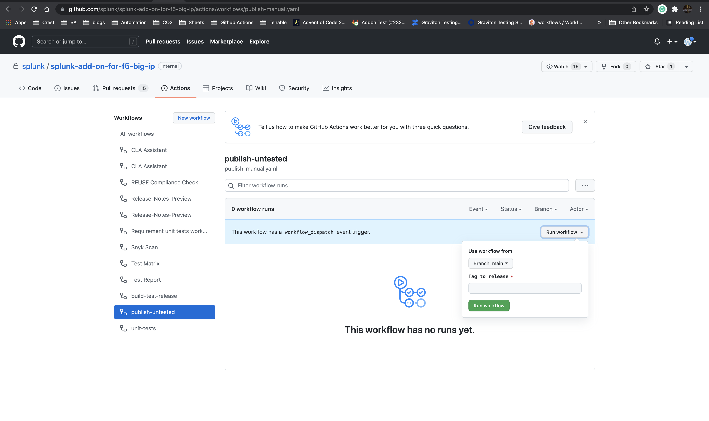 


release-set-git-tags
====================
**Description**

- This action updates major/minor release tags on a tag push. e.g. Update v1 and v1.2 tag when released v1.2.3.

**Action used** https://github.com/haya14busa/action-update-semver


Artifacts for different stages:
================================

- Artifacts can be found in the summary if we scroll to the bottom as shown in the screenshot below. <br />
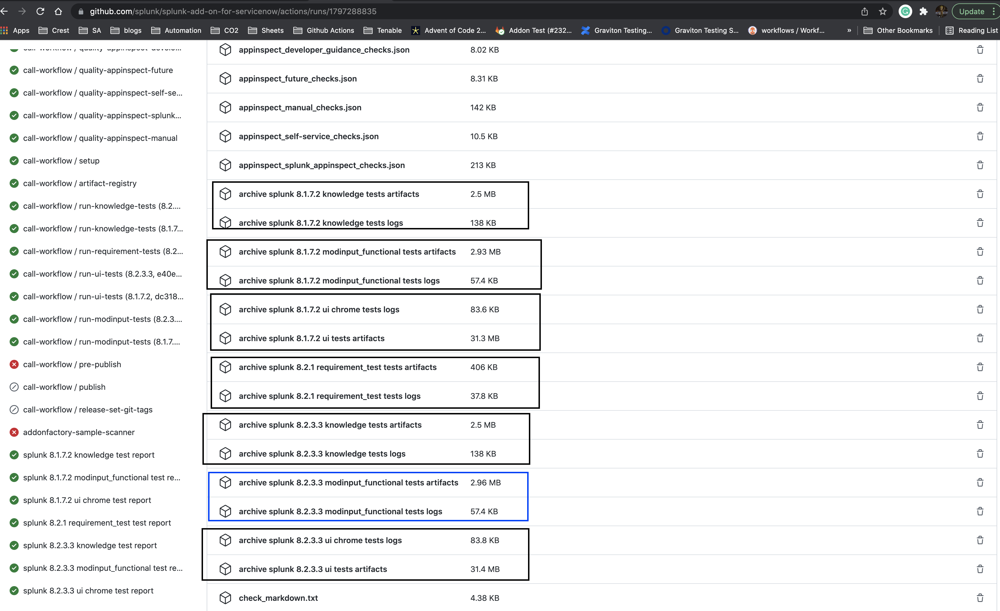 

- Link to the test-report for the stage can be found inside logs as shown here: 

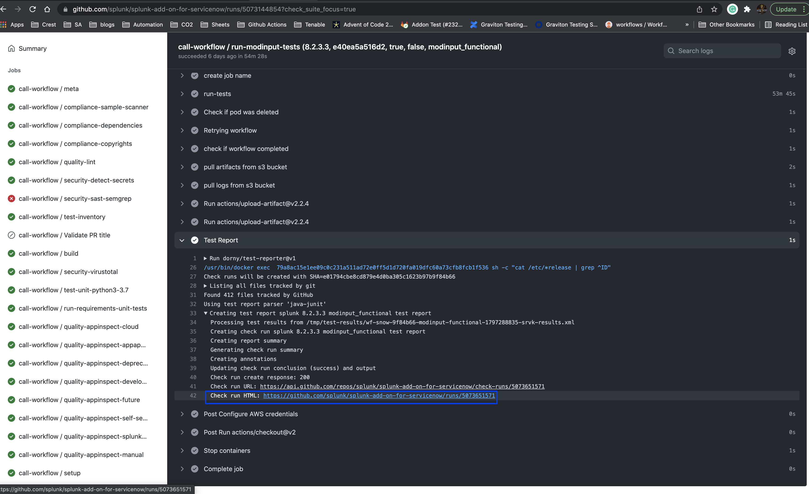 
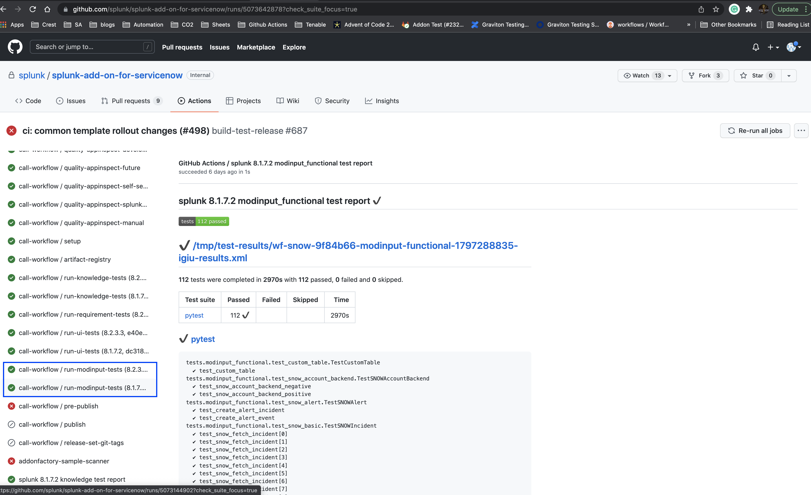 


Different Test reports stages
=============================
- addonfactory-sample-scanner
- splunk 8.x.y knowledge test report
- splunk 8.x.y modinput_functional test report
- splunk 8.x.y ui chrome test report
- splunk 8.x.y requirement_test test report
- splunk 8.x.y unit test report

To raise a Jira for an infrastructure issue/feature-request/help:
=================================================================
- If there is an infrastructure issue in Github actions Please raise a Jira with appropriate information in the description.

→ http://go/aqa/bug <br />
→ http://go/aqa/help <br />
→ http://go/aqa/feature <br />