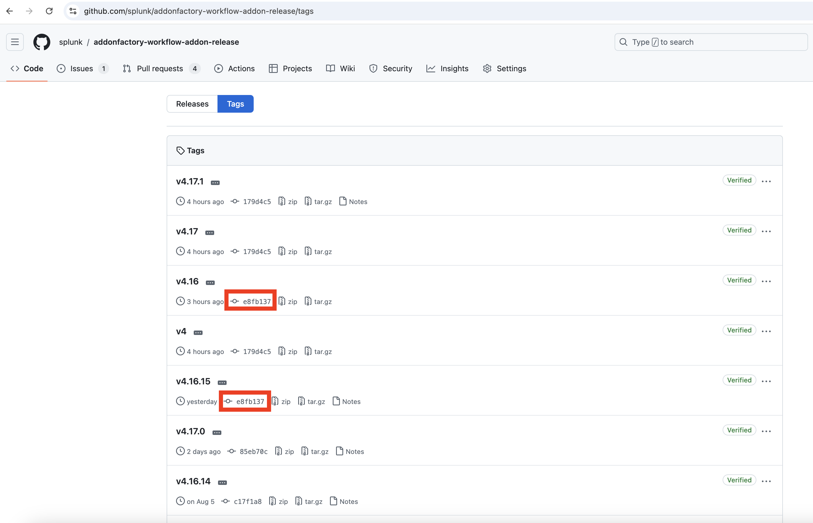

# Runbook to backport changes to previous versions of `addonfactory-workflow-addon-release` 
`addonfactory-workflow-addon-release` is utilized by all supported TAs. While it is strongly recommended to use the latest minor version of the reusable action, not all TAs consistently follow this guideline. As a result, there are cases when crucial updates introduced in the latest reusable workflow version need to be backported to its older versions that are still in use.

This runbook shows a real example of backporting changes correlated to `ta-automation-k8s-manifests`. In the example: 
- current version of `addonfactory-workflow-addon-release` is `v4.17.0`
- there was a bug in `ta-automation-k8s-manifests` affecting all TAs
  - there is a need to make a fix and release `v4.17.1` containing fixed `ta-automation-k8s-manifests` version ([PR](https://github.com/splunk/addonfactory-workflow-addon-release/pull/329))
  - there is need to backport it to `v4.16` (the old version which is still in use by some TAs)
  - the latest patch release of `v4.16` is `v4.16.14`
### Steps 
- make release `v4.17.1` with necessary changes
- fetch all existing tags from `addonfactory-workflow-addon-release`: 
  ```
  git checkout main
  git pull
  git fetch --tags
  ```
- checkout to the latest tag of the minor release you want to backport the changes to
  ```
  git checkout v4.16.14
  ```
- create a new branch based on the tag you are currently checked out to
  ```
  git checkout -b fix/bump-k8s-manifest-version
  ```
- changes made in `ta-automation-k8s-manifests` were correlated with changes in `addonfactory-workflow-addon-release`, so there is a need to backport **only necessary** changes to `v4.16`. There are two ways to do that: by cherrypicking specific commits (and resolving the conflicts if they exist) or by commiting necessary changes manually.
  - for example make necessary changes and commit them: 
    ```
    git add .github/workflows/reusable-build-test-release.yml
    git commit -m "fix: bump k8s-manifest version"
    ```
- push newly created branch to the remote repository
  - ```git push -u origin fix/bump-k8s-manifest-version```
- in GitHub UI: 
  - navigate to releases
  - draft a new release 
  - `Choose a tag`: type the tag that will be created, i.e. `v4.16.15` 
  - `Target` - newly created branch `fix/bump-k8s-manifest-version`
  - click on `Generate release notes` 
  - `Title of release` should be `v4.16.15 backport` 
  - write description of the changes 
  - uncheck `Set as the latest release` box 
  - click `Publish release`
  - check if the release is available, and it points at the proper version - https://github.com/splunk/addonfactory-workflow-addon-release/tags tag `v4.16` should point to the same commit as tag `v4.16.15` 
    
    Backporting changes will cause that the tag `v4` will point at the same commit as `v4.16`. To make it proper one has to either re-trigger the workflow which produced the latest tag (`v4.17.1`) or resolve that manually: 
    ```
    git fetch --tags -f 
    git tag -f v4 v4.17.1 
    git push -f --tags
    ```
- run the workflow for some TA using v4.16 to verify if the pipeline works as expected.